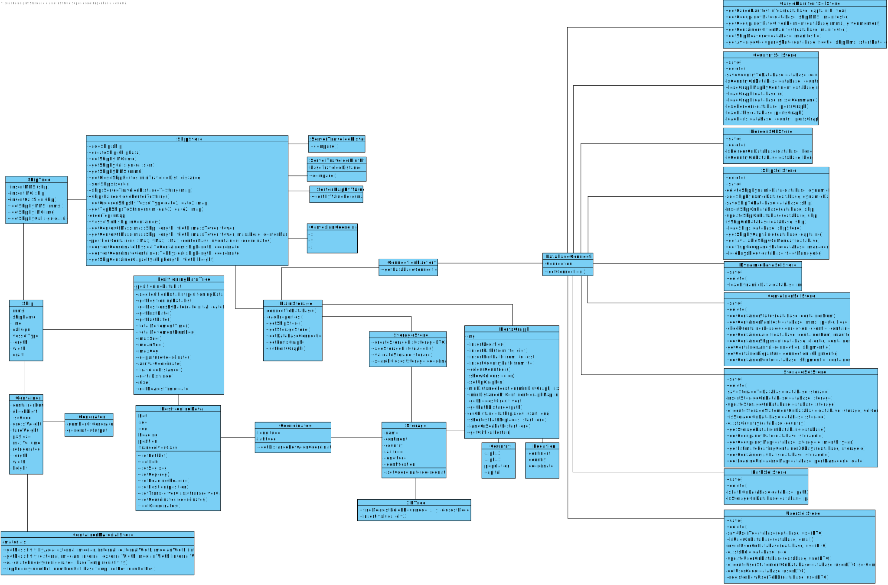

# Integrative Project - LEI - 2021/2022 - 1st Semester, 2nd Year

### Abstract
A cargo shipping company requires a software system to handle their logistics. This company
operates through land and sea, across different continents and has several warehouses spread along the
world.

## Project Software Structure

### Domain Model

### Class Diagram

### Database Model

## Project Scrum Management

- [Bitbucket](https://bitbucket.org/lei-isep/lapr3-2021-g021/src/master/)
- [Jira](https://jira.dei.isep.ipp.pt/secure/RapidBoard.jspa?rapidView=146&projectKey=LAP22G21&view=planning.nodetail&selectedIssue=LAP22G21-44&issueLimit=100)
- [Jenkins](https://jenkins.dei.isep.ipp.pt/job/lapr3-2021-g021/)
- [SonarQube](https://sonarqube.dei.isep.ipp.pt/dashboard?id=lapr3%3Acargo%3Alapr3-2021-g021)

### Burndown Chart - Sprint 1

### Sprint 2

### User Stories

Below are user story descriptions and links for analysis and design (DM, CD, SD, SSD) diagrams for each one.

|US|Description|
|:---|:--------|
[US101](docs/UserStories/US101)|As a traffic manager, I wish to import ships from a text file into a BST.|
[US102](docs/UserStories/US102)|As a traffic manager I which to search the details of a ship using any of its codes: MMSI, IMO or Call Sign.|
[US103](docs/UserStories/US103)|As a traffic manager I which to have the positional messages temporally organized and associated with each of the ships.|
[US104](docs/UserStories/US104)|As a traffic manager I which to make a Summary of a ship's movements.
[US105](docs/UserStories/US105)|As a traffic manager I which to list for all ships the MMSI, the total number of movements, Travelled Distance and Delta Distance.
[US106](docs/UserStories/US106)|Get the top-N ships with the most kilometres travelled and their average speed (MeanSOG).|
[US107](docs/UserStories/US107)|Return pairs of ships with routes with close departure/arrival coordinates (no more than 5 Kms away) and with different Travelled Distance.
[US108](docs)|As Project Manager, I want the team to develop the data model required to support all the functionality and to fulfill the purpose of the system to develop.
[US109](DataIntegrityRestrictionsTest.sql)|As Project Manager, I want the team to draft an SQL script to test  whether the database verifies all the data integrity restrictions that are required to fulfil the purpose of the system and the business constraints of the UoD.
[US110](DataDictionary.md)|As Project Manager, I want the team to define the naming conventions to apply when defining identifiers or writing SQL or PL/SQL code.
[US111](docs/LoadingValues.sql)|As Project Manager, I want the team to create a SQL script to load the database with a minimum set of data sufficient to carry out data integrity verification and functional testing.
[US201](docs/UserStories/US201)|As a Port manager, I which to import ports from a text file and create a 2D-treewith port locations.|
[US202](docs/UserStories/US202)|As a Traffic manager, I which to find the closest port of a ship given its CallSign,on a certain DateTime.
[US203](docs)|As Project Manager, I want the team to review the relational data model in viewof the new user stories so it can support all the requirements to fulfil the purpose of thesystem being developed.
[US204](docs/UserStories/US204)|As Client, I want to know the current situation of a specific container being used to transport my goods.
[US205](docs/UserStories/US205)|As Ship Captain, I want the list of containers to be offloaded in the next port, including container identifier, type, position, and load.
[US206](docs/UserStories/US206)|As Ship Captain, I want the list of containers to be loaded in the next port, including container identifier, type, and load.
[US207](docs/UserStories/US207)|As Ship Captain, I want to know how many cargo manifests I have transported during a given year and the average number of containers per manifest.
[US208](docs/UserStories/US208)|As Ship Captain, I want to know the occupancy rate (percentage) of a given ship for a given cargo manifest.
[US209](docs/UserStories/US209)|As Ship Captain, I want to know the occupancy rate of a given ship at a given moment.
[US210](docs/UserStories/US210)|As Traffic manager, I need to know which ships will be available on Monday next week and their location.

### Physics
  
To accommodate the design choice made to represent the user stories of physics a little method was made in which the following materials are registered: 
    
    - Stone Wool
    - Cork
    - Fiber-glass
    - Steel
    - Iron
    - Zinc
    - Aluminium

### Tests

Demo tests can be found on *src\test\java\lapr\project\presentationTests*, which output a file with the results of each user story.